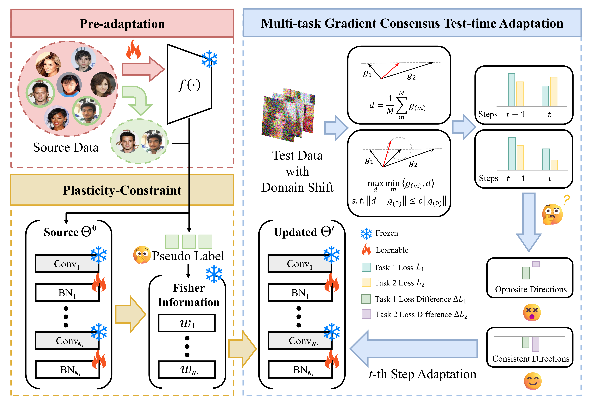
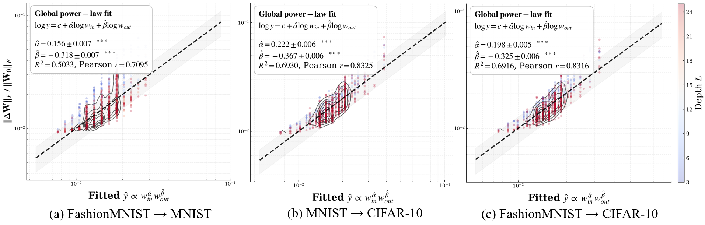








I'm Zhong Ye, a senior undergraduate student at Guangdong University of Technology. I've secured admission to the master's program at the same university, majoring in Artificial Intelligence. 

My research interests lie in the practical application of deep learning through mathematical modeling and implementation, specifically in Test-Time Adaptation (TTA), Continual Learning (CL), and AI for Science (Bioinformatics).

<!-- # 🔥 News
- *2025.11*: &nbsp;🎉🎉 Lorem ipsum dolor sit amet, consectetur adipiscing elit. Vivamus ornare aliquet ipsum, ac tempus justo dapibus sit amet.  -->

# 📝 Publications 

AAAI 2026

[Multi-Task Test-time Adaptation via Gradient Consensus and Plasticity Constraint](https://github.com/leafheavy/MT-TTA)

**Zhong Ye**, Yu Hu *(Corresponding Author)*, Zhenguo Yang

**Project Description** <strong></strong>
- We have open-sourced what is, to our knowledge, the first Test-Time Adaptation project for multi-task learning. We implemented multi-task versions of various classic TTA methods, including but not limited to: Tent, EATA.

Arxiv 2026

[Architecture-driven Shift: towards a lightweight selector for capturing the trends of logit shift](https://arxiv.org/abs/2605.27469)

**Zhong Ye**, Yu Hu *(Corresponding Author)*, Ruilin Tang

**Project Description** <strong></strong>
- We propose a theretical framework Architecture-driven Shift(ADS), enabling to extimate logit shift of model without a full training process in transfer/continual learning (CL) scenraios. Empirical validations prove that ADS captures the tendency of logit shift well and ADS-based selector is useful for reliable CL model selection.

# 🥇 Honors and Awards
- *2024.12*  **National Scholarship** *(China's highest honor for undergraduate students)*
- *2024.11*  **National Second Prize**, China Undergraduate Mathematical Contest in Modeling
- *2024.08* **National First Prize**, 2024 RAICOM National Finals *(Team Leader)* 

# 📖 Educations
- *2022.09 - 2026.06 (now)*, An undergraduate educated at Guangdong University of Technology. 
<!-- - *2015.09 - 2019.06*, Lorem ipsum dolor sit amet, consectetur adipiscing elit. Vivamus ornare aliquet ipsum, ac tempus justo dapibus sit amet.  -->

<!-- # 💬 Invited Talks
- *2021.06*, Lorem ipsum dolor sit amet, consectetur adipiscing elit. Vivamus ornare aliquet ipsum, ac tempus justo dapibus sit amet. 
- *2021.03*, Lorem ipsum dolor sit amet, consectetur adipiscing elit. Vivamus ornare aliquet ipsum, ac tempus justo dapibus sit amet.  \| [\[video\]](https://github.com/) -->

# 💻 Internships
- *2025.09 - 2026.02*, Conducted optimization of few-shot speech recognition algorithms for out-of-vocabulary (OOV) circumstance, successfully reducing the Error Rate (ER) by 8% on proprietary enterprise datasets. *Shenzhen NeoAI Future Technology Co., Ltd.*